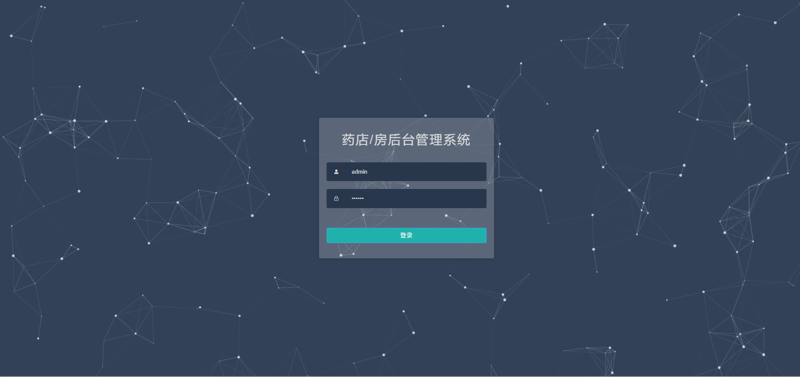
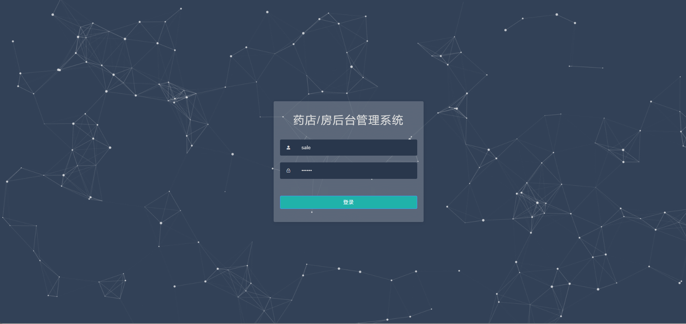
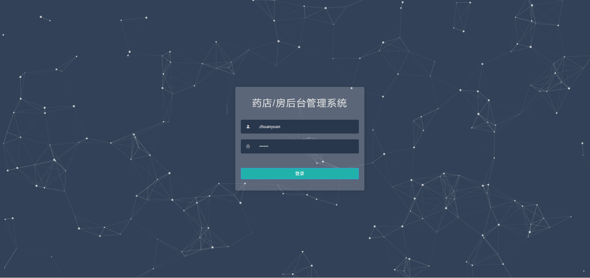

# drug🎂

基于SpringBoot+Vue的药品管理系统

## 介绍🌞

> 药品管理模块实现了药品的分类管理、进货管理和销售管理，库存管理模块实现了库存的实时监控和预警功能，销售管理模块实现了销售记录的管理和统计分析等。

## 软件架构

```
1. 药库管理，包括：药库库存、药库操作；
2. 药房管理，包括：药房库存、药房操作、发药操作；
3. 挂号管理，包括：挂号列表；
4. 系统管理，包括：账号管理、角色管理、权限管理、登录日志、数据库备份；
5. 基础设置，包括：药品管理、药品类型管理、病人类型管理。
```

## 项目演示🌞

> 管理员



> 销售



> 专员



## 安装教程🌞

```
1. 运行环境准备mysql8 + java8 + node14.16.1 + redis

2. 配置maven路径，加载依赖

3. 运行sql文件，确保application.yml或config.properties的数据库名称和账号密码是数据库所在主机的账号密码
```


## 使用说明🌞

```
1. 登入

    管理员账号：admin 密码：123456

    销售账号：sale 密码：123456

    专员账号：zhuanyuan 密码：123456
  
2. 运行流程

SpringBoot+Vue项目的部署详情可以查看这篇CSDN博客：http://t.csdnimg.cn/kpuxS

前后端不分离项目的部署流程可以查看这篇CSDN博客：http://t.csdnimg.cn/CslA5
```


## CSDN项目合集🌞

点击前往：http://t.csdnimg.cn/Q4u84


## 联系我🌞

**有偿获取完整源码或调试代码**

🐧：1902317191

微信：


